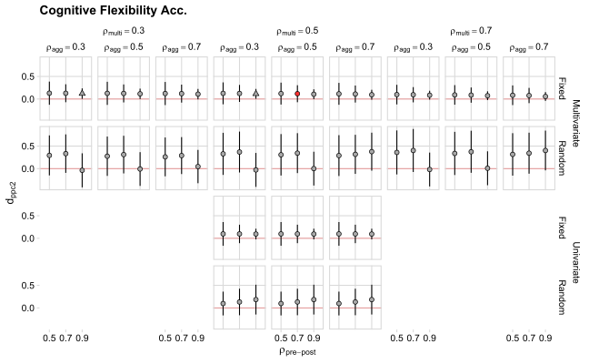

\pagebreak

# Introduction

This document explains in detail the statistical approach of the main paper. All the analyses are conducted with R [@r-lang] and all scripts are available on the [Open Science Framework repository](https://osf.io/uvbcd/).

- Section \@ref(dataset) presents the full dataset description with all extracted variables. Despite only a subset of these variables being used to compute the meta-analysis model, we reported all extracted study-level information.
- Section \@ref(effectsize) describes the computation of the effect size measure and the sampling variance.
- Section \@ref(models) describes the main meta-analysis model presented in the paper together with modeling alternatives
- Section \@ref(correlations) describes the correlations imputation that is necessary to compute the meta-analysis model
- Section \@ref(sens) presents the sensitivity analysis for different correlations values and different meta-analytic models 

## Meta-analysis

The meta-analysis is the statistical procedure to combine information from already conducted studies. The core aspect of a meta-analysis is weighting each included effect according to the amount of information (i.e., precision) that the study provides. In order to compute a meta-analysis model we need:

- The effect size measure
- The effect size sampling variance
- The meta-analysis model

## Papers

Almost all published papers reported enough information to calculate the effect size. Di Lieto and colleagues [-@Di_Lieto2020-tc] provided us with raw data to calculate all relevant parameters. They use a design with three time points (T0 = pre, T1 = post, and T2 = follow-up) for both the experimental and control group. Furthermore, they measured several different outcome measures. To include the paper in our meta-analysis we performed these processing steps:

- We selected only the T0 and T1 to have a single pre-post measure
- We included all participants that have both time points (T0 and T1) in at least one outcome measure. For example, if a child has T0 and T1 for the outcome $x$ but only T0 for the outcome $y$ we keep the child in the analysis. This creates a situation where different outcomes have different sample sizes but maximize the amount of available information instead of including children with all outcomes.

# Dataset description {#dataset}

The main dataset can be found on the online OSF repository under `data/raw/meta_table_cleaned.csv`. The following list describes the meaning of each column: 


- **paper**: Unique id for every paper 
 - **paper_id**: Unique id for every paper with authors and year 
 - **author**: Paper's authors 
 - **year**: Publication year 
 - **Participants**: Participants' characteristics: ST (typical development), SA (atypical development) 
 - **n_EX**: Sample size for the experimental group 
 - **n_CT**: Sample size for the control group 
 - **male_EX**: Number of males for the experimental group 
 - **female_EX**: Number of females for the experimental group 
 - **male_CT**: Number of males for the control group 
 - **female_CT**: Number of females for the control group 
 - **Training_length**: Lenght of the training (in weeks) 
 - **Minute_Training_length**: Lenght of a single training session (in minutes) 
 - **Training_Mode**: Type of training activity: CV (Virtual Coding), ER (Educational Robotics) 
 - **Training_CV_Type**: Types of virtual coding activities: structured and unstructured 
 - **M_SES_EX**: Mean socio-economic status (SES) for the experimental group 
 - **SD_SES_EX**: Standard deviation of socio-economic status (SES) for the experimental group 
 - **M_SES_CT**: Mean socio-economic status (SES) for the control group 
 - **SD_SES_CT**: Standard deviation of socio-economic status (SES) for the control group 
 - **M_age_CT**: Mean age for the control group 
 - **M_age_EX**: Mean age for the experimental group 
 - **outcome**: The outcome measure/test used 
 - **M_pre_EX**: Mean pre-training score for the experimental group 
 - **M_post_EX**: Mean post-training score for the experimental group 
 - **SD_pre_EX**: Standard deviation pre-training score for the experimental group 
 - **SD_post_EX**: Standard deviation post-training score for the experimental group 
 - **M_pre_CT**: Mean pre-training score for the control group 
 - **M_post_CT**: Mean post-training score for the control group 
 - **SD_pre_CT**: Standard deviation pre-training score for the control group 
 - **SD_post_CT**: Standard deviation post-training score for the control group 
 - **outcome2**: The recoded outcome variable 
 - **Flip_NoFlip**: Whether the effect size need to be flipped in order to have the same direction (i.e., positive values, the training improve performance) 
 - **eff_size**: The computed $dpcc_2$ 
 - **eff_size_var**: The computed $dpcc_2$ variance 
 - **eff_size_se**: The computed $dpcc_2$ standard error 

## Pre-processing steps

The raw dataset is available on the online [Open Science Framework repository](https://osf.io/uvbcd/). We performed these minimal pre-processing steps:

- renaming relevant columns
- re-coding the `outcome` variable into the `outcome2` variable (see the main paper for the rationale)
- separating the Arfè et al. (2019) paper into two separate papers (see Section \@ref(arfe2019))
- converting outcomes names into English

### Arfè et al. (2019) {#arfe2019}

Arfè et al. (2019) is the only paper that contains multiple independent (i.e., with different participants) sub-studies creating a multilevel structure. To reduce the data complexity we decided to consider these studies as two independent papers, creating Arfè et al. (2019a) and Arfè et al. (2019b).

## Multiple effects for the same outcome{#aggregation}

We decided to transform the `outcome` into the `outcome2` variable to have a smaller set of outcomes according to the underlying psychological construct. For example, if the test $x$ and the test $y$ are *Working Memory* measures we created a unique *Working Memory* variable.
This reduces the dataset complexity but creates a situation where papers have multiple effects belonging to the same outcome. We decided to aggregate multiple effects of the same `outcome2` using the approach suggested by Borenstein et al. [-@Borenstein2009-mo, pp.225-233] implemented using the `metafor::aggregate.escalc()` function (see https://wviechtb.github.io/metafor/reference/aggregate.escalc.html). 
To note, we use a slightly different approach compared to Borenstein et al.[-@Borenstein2009-mo, pp.225-233] computing an *inverse-variance weighted average* instead of an *un-weighted average*. Essentially, the weighted average combines multiple effect sizes taking into account the precision (i.e., the inverse of the variance).

We used the `metafor::aggregate.escalc()` as follows:


 \small


```r
aggregate_effects <- function(data, rho, split_by = paper, weighted = TRUE){
    split_by <- rlang::enexpr(split_by)
    data <- metafor::escalc(yi = eff_size, vi = eff_size_var, 
                   var.names = c("eff_size", "eff_size_var"),
                   data = data)
    dat_split <- split(data, pull(data, !!split_by))
    dat_split <- purrr::map_dfr(dat_split, function(x) {
        metafor::aggregate.escalc(x, 
                                  cluster = outcome2, 
                                  rho = rho, 
                                  weighted = weighted)
    })
    bind_rows(dat_split) %>% tibble()
}
```

 \normalsize

This is a wrapper of the `metafor::aggregate.escalc()` function that splits the dataset according to the `paper` and then aggregates within each `outcome2`.

# Effect size computation {#effectsize}

All included studies used a Pretest-Posttest-Control Group (PPC) design where the treated group is compared with an age-matched control group before and after a certain treatment. Morris [-@Morris2008-pe] described different effect size indexes for the PPC design. We decided to use the $d_{ppc2}$ index because it provides an unbiased estimation of the true effect size and the sampling variance can be analytically computed. The $d_{ppc2}$ is calculated as indicated in Equation \@ref(eq:dppc).

\begin{equation} 
  d_{ppc2} = c_p \frac{(M_{T,post} - M_{T,pre}) - (M_{C,post} - M_{C,pre})}{SD_{pooled,pre}}
  (\#eq:dppc)
\end{equation}

The numerator describes the actual mean difference between the treated and control groups of the respective *pre-post* scores. The difference is standardized using only a pooled standard deviation of pre-test scores. The variance is calculated in Equation \@ref(eq:dppc-sd):

\begin{equation} 
  \sigma^2(d_{ppc2}) = c^2_p(1-\rho)(\frac{n_t+n_c}{n_t n_c})(\frac{n_t+n_c-2}{n_t+n_c-4})(\frac{1 + \Delta^2}{2(1-\rho)(\frac{n_t+n_c}{n_t n_c})})
  (\#eq:dppc-sd)
\end{equation}

Both the $d_{ppc2}$ and the variance are adjusted using a small sample correction factor $c_p$ calculated in Equation \@ref(eq:cp)

\begin{equation} 
  c_p = 1 - \frac{3}{4(2n_t + 2n_c - 4) - 1}
  (\#eq:cp)
\end{equation}

Positive effect size values mean that the treatment increased the experimental group's performance. However, for some measures, higher values correspond to worse performance (e.g., the number of errors). In this case, we computed the effect size as described in the previous section and then we flipped the sign obtaining the same interpretation regardless of the original measure.

For the actual computation we wrote two functions following the documentation of the `metafor` package: (http://www.metafor-project.org/doku.php/analyses:morris2008), `get_dppc2()`:


```r
get_dppc2 <- function(mt_pre, mt_post, mc_pre, mc_post,
                      st_pre, st_post, sc_pre, sc_post,
                      nt, nc){
    
    mdiff <- (mt_post - mt_pre) - (mc_post - mc_pre)
    poolvar <- sqrt(((((nt - 1) * st_pre^2) + ((nc - 1) * sc_pre^2)) / (nt + nc - 2)))
    cp <- metafor:::.cmicalc(nt + nc - 2)
    
    dppc2 <- (mdiff / poolvar) * cp
    
    return(dppc2)
    
}
```

and `get_dppc2_var()`:


```r
get_dppc2_var <- function(dppc2, nt, nc, rho){
    
    dppc2_var <- 2*(1-rho) * (1/nt + 1/nc) + dppc2^2 / (2*(nt + nc))
    
    return(dppc2_var)
    
}
```

# Meta-analysis models {#models}

## Univariate vs multivariate model {#uni-vs-multi}

When multiple variables are collected from the same pool of participants (e.g., multiple outcomes studies) and/or there are multiple experiments within the same paper, the effect size cannot be considered independent [@Cheung2019-po; @Cheung2014-fg]. Instead of pooling multiple effects into a single measure or keeping only a single effect, we computed a multivariate meta-analysis model taking into account the dependency (i.e., the correlation) between multiple effect sizes calculated on the same pool of participants. To compute the multivariate model we need to include or impute the variance-covariance matrix that describes how multiple effects correlate within each study. The section \@ref(correlations) explains our imputation approach.

## Random-effect vs fixed-effect model

Another important choice is between the fixed-effect and the random-effect model. Under the fixed-effect model, we make the assumption of a single *true* effect size that is estimated by a sample of studies. For this reason, the variability observed in the empirical meta-analysis is only caused by the sampling error.

On the other side, the *random-effect* model assumes a *distribution* of *true* effects. The model estimate the average effect (the *mean* of the distribution) and the between-study heterogeneity $\tau^2$ (i.e., the *variance* of the distribution). The critical assumption is that the observed heterogeneity is composed of sampling variability (as the *fixed-effect* model) and *true* between-study variability. The latter can be caused by different experimental designs, participants' features, or other study-level variables and can be explained using moderators (i.e., meta-regression).

The goal of the *random-effect* model is to generalize the meta-analytic findings at the population level while the *fixed-effect* model is focused on a specific pool of studies. 

We decided to use a *fixed-effect* model for several reasons.  Firstly, one reason to estimate $\tau^2$ (i.e., the focus of the *random-effect* model) is to explain the observed heterogeneity with study-level variables. Given our limited pool of studies, we did not include a meta-regression analysis. Furthermore, Under the *random-effect* framework, the multivariate model estimates the average effect and the variability ($\tau^2$) for each included outcome increasing the model complexity compared to the univariate counterpart. Crucially, with a limited number of studies the $\tau^2$ estimation can be strongly biased [@Veroniki2016-nw] influencing also the pooled effect estimation [@Borenstein2009-mo, pp.73-75] especially in terms of the standard error. Finally, the *fixed-effect* is less complex in terms of model parameters because we need to estimate only the average effect of each included outcome, taking into account the statistical dependency (see \@ref(uni-vs-multi)).

## Modelling functions

We tested each model parameter (i.e., average effect for a specific outcome) using the Wald *z-test* with $\alpha = 0.05$.  
For the *univariate fixed-effect* model we use the `metafor::rma()` function:


```r
fit_uni_fixed <- function(data){
    rma(yi = eff_size, 
        vi = eff_size_var,
        method = "FE",
        data = data)
}
```

For the *univariate random-effect* model we use the `metafor::rma()` function and the REML estimator for $\tau^2$:


```r
fit_uni_random <- function(data){
    rma(yi = eff_size, 
        vi = eff_size_var,
        method = "REML",
        data = data)
}
```

For the *multivariate fixed-effect* model we use the `metafor::rma.mv()` function:


```r
fit_multi_fixed <- function(data, cov_matrix){
    rma.mv(
        yi = eff_size,
        V = cov_matrix,
        mods = ~ 0 + outcome2,
        data = data)
}
```

For the *multivariate random-effect* model we use the `metafor::rma.mv()` function:


```r
fit_multi_random <- function(data, cov_matrix, struct = "UN"){
    rma.mv(
        yi = eff_size,
        V = cov_matrix,
        mods = ~ 0 + outcome2,
        random = ~ outcome2|paper_id,
        # the variance-covariance matrix structure 
        # see https://wviechtb.github.io/metafor/reference/rma.mv.html
        struct = struct,
        data = data)
}
```

In both the multivariate cases we used the `outcome2` variable as a moderator with a *cell-mean parametrization* [@Schad2020-ht] (i.e., removing the intercept `0 + outcome2`). In this way model parameters and statistical tests correspond directly to the average effect for each outcome.  As explained in the previous section, the random-effect model estimate also a $\tau^2$ for each outcome (written as `random = ~ outcome2|paper_id`, see https://www.metafor-project.org/doku.php/analyses:berkey1995).

### Variance-covariance matrix

For the *multivariate* models (both fixed and random) is necessary to include a variance-covariance matrix. Essentially, each study has $n$ different outcomes and we need a $n \times n$ variance-covariance matrices where the diagonal is the $d_{pcc2}$ variance for a specific outcome and off-diagonal elements are the covariances between pairs of outcomes.

Combining all study-level matrices we obtain a full block-variance-covariance matrix to use within the `rma.mv()` function. The `metafor::vcalc()` (see https://wviechtb.github.io/metafor/reference/vcalc.html) function allows to create the full matrix specifying the assumed correlation and a clustering variable:


```r
get_block_cov_matrix <- function(data, rho){
    vcalc(eff_size_var, cluster = paper_id, obs = effect_id, data = data, rho = rho)
}
```

# Correlations imputation{#correlations}

As explained in previous sections, we decided to use a *fixed-effect multivariate* model. To compute the model we need to include 3 correlations measures:

- For the effect size computation, we need the correlation between pre-post (*pre-post correlation*) scores for both groups
- For the aggregation of multiple effects within the same paper (*aggregation correlation*) (see Section \@ref(aggregation)) we need the correlation between the effects
- For the actual multivariate model we need the full variance-covariance matrix of different outcomes. To create the matrix we need to include the correlation between outcomes within each study (*multivariate correlation*).

Correlations are rarely reported in published papers, thus we decided to impute these values and assess the impact with a multiverse-like approach [@Steegen2016-lz]. In particular, we used:

- A $\rho_{pre-post}$ of 0.5, 0.7 and 0.9
- A $\rho_{agg}$ of 0.3, 0.5, 0.7
- A $\rho_{multi}$ of 0.3, 0.5 and 0.7

# Meta-analysis table

Table \@ref(tab:metatab) describes all included papers with pre-post scores for the experimental and control groups and the computed effect size. Furthermore, the table is organized grouping the effects according to the considered outcome in order to highlight the multivariate data structure.

```{=html}
<template id="dc80432b-529a-46f5-9a8d-e4d38bfdca4f"><style>
.tabwid table{
  border-spacing:0px !important;
  border-collapse:collapse;
  line-height:1;
  margin-left:auto;
  margin-right:auto;
  border-width: 0;
  border-color: transparent;
  caption-side: top;
}
.tabwid-caption-bottom table{
  caption-side: bottom;
}
.tabwid_left table{
  margin-left:0;
}
.tabwid_right table{
  margin-right:0;
}
.tabwid td, .tabwid th {
    padding: 0;
}
.tabwid a {
  text-decoration: none;
}
.tabwid thead {
    background-color: transparent;
}
.tabwid tfoot {
    background-color: transparent;
}
.tabwid table tr {
background-color: transparent;
}
.katex-display {
    margin: 0 0 !important;
}
</style><div class="tabwid"><style>.cl-28f6a1ae{}.cl-28e28ea8{font-family:'Arial';font-size:7pt;font-weight:bold;font-style:normal;text-decoration:none;color:rgba(0, 0, 0, 1.00);background-color:transparent;}.cl-28e28ebc{font-family:'Arial';font-size:4.2pt;font-weight:bold;font-style:normal;text-decoration:none;color:rgba(0, 0, 0, 1.00);background-color:transparent;position: relative;top:2.1pt;}.cl-28e28ebd{font-family:'Arial';font-size:7pt;font-weight:normal;font-style:normal;text-decoration:none;color:rgba(0, 0, 0, 1.00);background-color:transparent;}.cl-28ea172c{margin:0;text-align:center;border-bottom: 0 solid rgba(0, 0, 0, 1.00);border-top: 0 solid rgba(0, 0, 0, 1.00);border-left: 0 solid rgba(0, 0, 0, 1.00);border-right: 0 solid rgba(0, 0, 0, 1.00);padding-bottom:5pt;padding-top:5pt;padding-left:5pt;padding-right:5pt;line-height: 1;background-color:transparent;}.cl-28ea50fc{width:0.932in;background-color:transparent;vertical-align: middle;border-bottom: 2pt solid rgba(102, 102, 102, 1.00);border-top: 2pt solid rgba(102, 102, 102, 1.00);border-left: 0 solid rgba(0, 0, 0, 1.00);border-right: 0 solid rgba(0, 0, 0, 1.00);margin-bottom:0;margin-top:0;margin-left:0;margin-right:0;}.cl-28ea5106{width:1.012in;background-color:transparent;vertical-align: middle;border-bottom: 2pt solid rgba(102, 102, 102, 1.00);border-top: 2pt solid rgba(102, 102, 102, 1.00);border-left: 0 solid rgba(0, 0, 0, 1.00);border-right: 1pt solid rgba(102, 102, 102, 1.00);margin-bottom:0;margin-top:0;margin-left:0;margin-right:0;}.cl-28ea5107{width:0.275in;background-color:transparent;vertical-align: middle;border-bottom: 2pt solid rgba(102, 102, 102, 1.00);border-top: 2pt solid rgba(102, 102, 102, 1.00);border-left: 1pt solid rgba(102, 102, 102, 1.00);border-right: 0 solid rgba(0, 0, 0, 1.00);margin-bottom:0;margin-top:0;margin-left:0;margin-right:0;}.cl-28ea5110{width:0.369in;background-color:transparent;vertical-align: middle;border-bottom: 2pt solid rgba(102, 102, 102, 1.00);border-top: 2pt solid rgba(102, 102, 102, 1.00);border-left: 0 solid rgba(0, 0, 0, 1.00);border-right: 0 solid rgba(0, 0, 0, 1.00);margin-bottom:0;margin-top:0;margin-left:0;margin-right:0;}.cl-28ea5111{width:0.369in;background-color:transparent;vertical-align: middle;border-bottom: 2pt solid rgba(102, 102, 102, 1.00);border-top: 2pt solid rgba(102, 102, 102, 1.00);border-left: 0 solid rgba(0, 0, 0, 1.00);border-right: 1pt solid rgba(102, 102, 102, 1.00);margin-bottom:0;margin-top:0;margin-left:0;margin-right:0;}.cl-28ea511a{width:0.551in;background-color:transparent;vertical-align: middle;border-bottom: 2pt solid rgba(102, 102, 102, 1.00);border-top: 2pt solid rgba(102, 102, 102, 1.00);border-left: 1pt solid rgba(102, 102, 102, 1.00);border-right: 0 solid rgba(0, 0, 0, 1.00);margin-bottom:0;margin-top:0;margin-left:0;margin-right:0;}.cl-28ea511b{width:0.932in;background-color:transparent;vertical-align: middle;border-bottom: 2pt solid rgba(102, 102, 102, 1.00);border-top: 2pt solid rgba(102, 102, 102, 1.00);border-left: 0 solid rgba(0, 0, 0, 1.00);border-right: 0 solid rgba(0, 0, 0, 1.00);margin-bottom:0;margin-top:0;margin-left:0;margin-right:0;}.cl-28ea5124{width:1.012in;background-color:transparent;vertical-align: middle;border-bottom: 2pt solid rgba(102, 102, 102, 1.00);border-top: 2pt solid rgba(102, 102, 102, 1.00);border-left: 0 solid rgba(0, 0, 0, 1.00);border-right: 1pt solid rgba(102, 102, 102, 1.00);margin-bottom:0;margin-top:0;margin-left:0;margin-right:0;}.cl-28ea5125{width:0.275in;background-color:transparent;vertical-align: middle;border-bottom: 2pt solid rgba(102, 102, 102, 1.00);border-top: 2pt solid rgba(102, 102, 102, 1.00);border-left: 1pt solid rgba(102, 102, 102, 1.00);border-right: 0 solid rgba(0, 0, 0, 1.00);margin-bottom:0;margin-top:0;margin-left:0;margin-right:0;}.cl-28ea512e{width:0.369in;background-color:transparent;vertical-align: middle;border-bottom: 2pt solid rgba(102, 102, 102, 1.00);border-top: 2pt solid rgba(102, 102, 102, 1.00);border-left: 0 solid rgba(0, 0, 0, 1.00);border-right: 0 solid rgba(0, 0, 0, 1.00);margin-bottom:0;margin-top:0;margin-left:0;margin-right:0;}.cl-28ea512f{width:0.369in;background-color:transparent;vertical-align: middle;border-bottom: 2pt solid rgba(102, 102, 102, 1.00);border-top: 2pt solid rgba(102, 102, 102, 1.00);border-left: 0 solid rgba(0, 0, 0, 1.00);border-right: 1pt solid rgba(102, 102, 102, 1.00);margin-bottom:0;margin-top:0;margin-left:0;margin-right:0;}.cl-28ea5138{width:0.551in;background-color:transparent;vertical-align: middle;border-bottom: 2pt solid rgba(102, 102, 102, 1.00);border-top: 2pt solid rgba(102, 102, 102, 1.00);border-left: 1pt solid rgba(102, 102, 102, 1.00);border-right: 0 solid rgba(0, 0, 0, 1.00);margin-bottom:0;margin-top:0;margin-left:0;margin-right:0;}.cl-28ea5139{width:0.932in;background-color:transparent;vertical-align: middle;border-bottom: 0.5pt solid rgba(102, 102, 102, 1.00);border-top: 0 solid rgba(0, 0, 0, 1.00);border-left: 0 solid rgba(0, 0, 0, 1.00);border-right: 0 solid rgba(0, 0, 0, 1.00);margin-bottom:0;margin-top:0;margin-left:0;margin-right:0;}.cl-28ea513a{width:1.012in;background-color:transparent;vertical-align: middle;border-bottom: 0.5pt solid rgba(102, 102, 102, 1.00);border-top: 0 solid rgba(0, 0, 0, 1.00);border-left: 0 solid rgba(0, 0, 0, 1.00);border-right: 1pt solid rgba(102, 102, 102, 1.00);margin-bottom:0;margin-top:0;margin-left:0;margin-right:0;}.cl-28ea513b{width:0.275in;background-color:transparent;vertical-align: middle;border-bottom: 0.5pt solid rgba(102, 102, 102, 1.00);border-top: 0 solid rgba(0, 0, 0, 1.00);border-left: 1pt solid rgba(102, 102, 102, 1.00);border-right: 0 solid rgba(0, 0, 0, 1.00);margin-bottom:0;margin-top:0;margin-left:0;margin-right:0;}.cl-28ea5142{width:0.369in;background-color:transparent;vertical-align: middle;border-bottom: 0.5pt solid rgba(102, 102, 102, 1.00);border-top: 0 solid rgba(0, 0, 0, 1.00);border-left: 0 solid rgba(0, 0, 0, 1.00);border-right: 0 solid rgba(0, 0, 0, 1.00);margin-bottom:0;margin-top:0;margin-left:0;margin-right:0;}.cl-28ea5143{width:0.369in;background-color:transparent;vertical-align: middle;border-bottom: 0.5pt solid rgba(102, 102, 102, 1.00);border-top: 0 solid rgba(0, 0, 0, 1.00);border-left: 0 solid rgba(0, 0, 0, 1.00);border-right: 1pt solid rgba(102, 102, 102, 1.00);margin-bottom:0;margin-top:0;margin-left:0;margin-right:0;}.cl-28ea5144{width:0.551in;background-color:transparent;vertical-align: middle;border-bottom: 0.5pt solid rgba(102, 102, 102, 1.00);border-top: 0 solid rgba(0, 0, 0, 1.00);border-left: 1pt solid rgba(102, 102, 102, 1.00);border-right: 0 solid rgba(0, 0, 0, 1.00);margin-bottom:0;margin-top:0;margin-left:0;margin-right:0;}.cl-28ea514c{width:0.932in;background-color:transparent;vertical-align: middle;border-bottom: 0.5pt solid rgba(102, 102, 102, 1.00);border-top: 0.5pt solid rgba(102, 102, 102, 1.00);border-left: 0 solid rgba(0, 0, 0, 1.00);border-right: 0 solid rgba(0, 0, 0, 1.00);margin-bottom:0;margin-top:0;margin-left:0;margin-right:0;}.cl-28ea514d{width:1.012in;background-color:transparent;vertical-align: middle;border-bottom: 0.5pt solid rgba(102, 102, 102, 1.00);border-top: 0.5pt solid rgba(102, 102, 102, 1.00);border-left: 0 solid rgba(0, 0, 0, 1.00);border-right: 1pt solid rgba(102, 102, 102, 1.00);margin-bottom:0;margin-top:0;margin-left:0;margin-right:0;}.cl-28ea5156{width:0.275in;background-color:transparent;vertical-align: middle;border-bottom: 0.5pt solid rgba(102, 102, 102, 1.00);border-top: 0.5pt solid rgba(102, 102, 102, 1.00);border-left: 1pt solid rgba(102, 102, 102, 1.00);border-right: 0 solid rgba(0, 0, 0, 1.00);margin-bottom:0;margin-top:0;margin-left:0;margin-right:0;}.cl-28ea5157{width:0.369in;background-color:transparent;vertical-align: middle;border-bottom: 0.5pt solid rgba(102, 102, 102, 1.00);border-top: 0.5pt solid rgba(102, 102, 102, 1.00);border-left: 0 solid rgba(0, 0, 0, 1.00);border-right: 0 solid rgba(0, 0, 0, 1.00);margin-bottom:0;margin-top:0;margin-left:0;margin-right:0;}.cl-28ea5158{width:0.369in;background-color:transparent;vertical-align: middle;border-bottom: 0.5pt solid rgba(102, 102, 102, 1.00);border-top: 0.5pt solid rgba(102, 102, 102, 1.00);border-left: 0 solid rgba(0, 0, 0, 1.00);border-right: 1pt solid rgba(102, 102, 102, 1.00);margin-bottom:0;margin-top:0;margin-left:0;margin-right:0;}.cl-28ea5160{width:0.551in;background-color:transparent;vertical-align: middle;border-bottom: 0.5pt solid rgba(102, 102, 102, 1.00);border-top: 0.5pt solid rgba(102, 102, 102, 1.00);border-left: 1pt solid rgba(102, 102, 102, 1.00);border-right: 0 solid rgba(0, 0, 0, 1.00);margin-bottom:0;margin-top:0;margin-left:0;margin-right:0;}.cl-28ea5161{width:0.932in;background-color:transparent;vertical-align: middle;border-bottom: 2pt solid rgba(102, 102, 102, 1.00);border-top: 0.5pt solid rgba(102, 102, 102, 1.00);border-left: 0 solid rgba(0, 0, 0, 1.00);border-right: 0 solid rgba(0, 0, 0, 1.00);margin-bottom:0;margin-top:0;margin-left:0;margin-right:0;}.cl-28ea516a{width:1.012in;background-color:transparent;vertical-align: middle;border-bottom: 2pt solid rgba(102, 102, 102, 1.00);border-top: 0.5pt solid rgba(102, 102, 102, 1.00);border-left: 0 solid rgba(0, 0, 0, 1.00);border-right: 1pt solid rgba(102, 102, 102, 1.00);margin-bottom:0;margin-top:0;margin-left:0;margin-right:0;}.cl-28ea516b{width:0.275in;background-color:transparent;vertical-align: middle;border-bottom: 2pt solid rgba(102, 102, 102, 1.00);border-top: 0.5pt solid rgba(102, 102, 102, 1.00);border-left: 1pt solid rgba(102, 102, 102, 1.00);border-right: 0 solid rgba(0, 0, 0, 1.00);margin-bottom:0;margin-top:0;margin-left:0;margin-right:0;}.cl-28ea516c{width:0.369in;background-color:transparent;vertical-align: middle;border-bottom: 2pt solid rgba(102, 102, 102, 1.00);border-top: 0.5pt solid rgba(102, 102, 102, 1.00);border-left: 0 solid rgba(0, 0, 0, 1.00);border-right: 0 solid rgba(0, 0, 0, 1.00);margin-bottom:0;margin-top:0;margin-left:0;margin-right:0;}.cl-28ea5174{width:0.369in;background-color:transparent;vertical-align: middle;border-bottom: 2pt solid rgba(102, 102, 102, 1.00);border-top: 0.5pt solid rgba(102, 102, 102, 1.00);border-left: 0 solid rgba(0, 0, 0, 1.00);border-right: 1pt solid rgba(102, 102, 102, 1.00);margin-bottom:0;margin-top:0;margin-left:0;margin-right:0;}.cl-28ea5175{width:0.551in;background-color:transparent;vertical-align: middle;border-bottom: 2pt solid rgba(102, 102, 102, 1.00);border-top: 0.5pt solid rgba(102, 102, 102, 1.00);border-left: 1pt solid rgba(102, 102, 102, 1.00);border-right: 0 solid rgba(0, 0, 0, 1.00);margin-bottom:0;margin-top:0;margin-left:0;margin-right:0;}</style><table class='cl-28f6a1ae'>

```

<caption>(\#tab:metatab)<span>Pre-post scores (M = mean, SD = standard deviation, N = sample size) for the control and experimental group. The last two columns represent the computed effect size and the variance. The effects are organized according to the outcome value and the corresponding paper.</span></caption>

```{=html}

<thead><tr style="overflow-wrap:break-word;"><th  colspan="2"class="cl-28ea50fc"><p class="cl-28ea172c"><span class="cl-28e28ea8"></span></p></th><th  colspan="5"class="cl-28ea5107"><p class="cl-28ea172c"><span class="cl-28e28ea8">Experimental Group</span></p></th><th  colspan="5"class="cl-28ea5107"><p class="cl-28ea172c"><span class="cl-28e28ea8">Control Group</span></p></th><th class="cl-28ea511a"><p class="cl-28ea172c"><span class="cl-28e28ea8"></span></p></th></tr><tr style="overflow-wrap:break-word;"><th class="cl-28ea511b"><p class="cl-28ea172c"><span class="cl-28e28ea8">Outcome</span></p></th><th class="cl-28ea5124"><p class="cl-28ea172c"><span class="cl-28e28ea8">Paper</span></p></th><th class="cl-28ea5125"><p class="cl-28ea172c"><span class="cl-28e28ea8">N</span></p></th><th class="cl-28ea512e"><p class="cl-28ea172c"><span class="cl-28e28ea8">M</span><span class="cl-28e28ebc">pre</span></p></th><th class="cl-28ea512e"><p class="cl-28ea172c"><span class="cl-28e28ea8">M</span><span class="cl-28e28ebc">post</span></p></th><th class="cl-28ea512e"><p class="cl-28ea172c"><span class="cl-28e28ea8">SD</span><span class="cl-28e28ebc">pre</span></p></th><th class="cl-28ea512f"><p class="cl-28ea172c"><span class="cl-28e28ea8">SD</span><span class="cl-28e28ebc">post</span></p></th><th class="cl-28ea5125"><p class="cl-28ea172c"><span class="cl-28e28ea8">N</span></p></th><th class="cl-28ea512e"><p class="cl-28ea172c"><span class="cl-28e28ea8">M</span><span class="cl-28e28ebc">pre</span></p></th><th class="cl-28ea512e"><p class="cl-28ea172c"><span class="cl-28e28ea8">M</span><span class="cl-28e28ebc">post</span></p></th><th class="cl-28ea512e"><p class="cl-28ea172c"><span class="cl-28e28ea8">SD</span><span class="cl-28e28ebc">pre</span></p></th><th class="cl-28ea512f"><p class="cl-28ea172c"><span class="cl-28e28ea8">SD</span><span class="cl-28e28ebc">post</span></p></th><th class="cl-28ea5138"><p class="cl-28ea172c"><span class="cl-28e28ea8">d</span><span class="cl-28e28ebc">ppc2</span><span class="cl-28e28ea8">(σ)</span></p></th></tr></thead><tbody><tr style="overflow-wrap:break-word;"><td  rowspan="2"class="cl-28ea5139"><p class="cl-28ea172c"><span class="cl-28e28ebd">Cognitive Flexibility Acc.</span></p></td><td class="cl-28ea513a"><p class="cl-28ea172c"><span class="cl-28e28ebd">Di Lieto et al. (2020a)</span></p></td><td class="cl-28ea513b"><p class="cl-28ea172c"><span class="cl-28e28ebd">96</span></p></td><td class="cl-28ea5142"><p class="cl-28ea172c"><span class="cl-28e28ebd">7.22</span></p></td><td class="cl-28ea5142"><p class="cl-28ea172c"><span class="cl-28e28ebd">8.39</span></p></td><td class="cl-28ea5142"><p class="cl-28ea172c"><span class="cl-28e28ebd">2.06</span></p></td><td class="cl-28ea5143"><p class="cl-28ea172c"><span class="cl-28e28ebd">1.69</span></p></td><td class="cl-28ea513b"><p class="cl-28ea172c"><span class="cl-28e28ebd">91</span></p></td><td class="cl-28ea5142"><p class="cl-28ea172c"><span class="cl-28e28ebd">7.19</span></p></td><td class="cl-28ea5142"><p class="cl-28ea172c"><span class="cl-28e28ebd">8.27</span></p></td><td class="cl-28ea5142"><p class="cl-28ea172c"><span class="cl-28e28ebd">2.10</span></p></td><td class="cl-28ea5143"><p class="cl-28ea172c"><span class="cl-28e28ebd">1.66</span></p></td><td class="cl-28ea5144"><p class="cl-28ea172c"><span class="cl-28e28ebd">0.04 (0.01)</span></p></td></tr><tr style="overflow-wrap:break-word;"><td class="cl-28ea514d"><p class="cl-28ea172c"><span class="cl-28e28ebd">Di Lieto et al. (2020b)</span></p></td><td class="cl-28ea5156"><p class="cl-28ea172c"><span class="cl-28e28ebd">18</span></p></td><td class="cl-28ea5157"><p class="cl-28ea172c"><span class="cl-28e28ebd">5.72</span></p></td><td class="cl-28ea5157"><p class="cl-28ea172c"><span class="cl-28e28ebd">6.61</span></p></td><td class="cl-28ea5157"><p class="cl-28ea172c"><span class="cl-28e28ebd">2.37</span></p></td><td class="cl-28ea5158"><p class="cl-28ea172c"><span class="cl-28e28ebd">2.12</span></p></td><td class="cl-28ea5156"><p class="cl-28ea172c"><span class="cl-28e28ebd">18</span></p></td><td class="cl-28ea5157"><p class="cl-28ea172c"><span class="cl-28e28ebd">7.05</span></p></td><td class="cl-28ea5157"><p class="cl-28ea172c"><span class="cl-28e28ebd">7.05</span></p></td><td class="cl-28ea5157"><p class="cl-28ea172c"><span class="cl-28e28ebd">2.15</span></p></td><td class="cl-28ea5158"><p class="cl-28ea172c"><span class="cl-28e28ebd">2.41</span></p></td><td class="cl-28ea5160"><p class="cl-28ea172c"><span class="cl-28e28ebd">0.38 (0.07)</span></p></td></tr><tr style="overflow-wrap:break-word;"><td  rowspan="5"class="cl-28ea514c"><p class="cl-28ea172c"><span class="cl-28e28ebd">Inhibition Acc.</span></p></td><td class="cl-28ea514d"><p class="cl-28ea172c"><span class="cl-28e28ebd">Arfé et al. (2019a)</span></p></td><td class="cl-28ea5156"><p class="cl-28ea172c"><span class="cl-28e28ebd">44</span></p></td><td class="cl-28ea5157"><p class="cl-28ea172c"><span class="cl-28e28ebd">4.63</span></p></td><td class="cl-28ea5157"><p class="cl-28ea172c"><span class="cl-28e28ebd">1.79</span></p></td><td class="cl-28ea5157"><p class="cl-28ea172c"><span class="cl-28e28ebd">4.45</span></p></td><td class="cl-28ea5158"><p class="cl-28ea172c"><span class="cl-28e28ebd">2.01</span></p></td><td class="cl-28ea5156"><p class="cl-28ea172c"><span class="cl-28e28ebd">36</span></p></td><td class="cl-28ea5157"><p class="cl-28ea172c"><span class="cl-28e28ebd">5.76</span></p></td><td class="cl-28ea5157"><p class="cl-28ea172c"><span class="cl-28e28ebd">4.16</span></p></td><td class="cl-28ea5157"><p class="cl-28ea172c"><span class="cl-28e28ebd">4.36</span></p></td><td class="cl-28ea5158"><p class="cl-28ea172c"><span class="cl-28e28ebd">3.72</span></p></td><td class="cl-28ea5160"><p class="cl-28ea172c"><span class="cl-28e28ebd">0.21 (0.02)</span></p></td></tr><tr style="overflow-wrap:break-word;"><td class="cl-28ea514d"><p class="cl-28ea172c"><span class="cl-28e28ebd">Arfé et al. (2019b)</span></p></td><td class="cl-28ea5156"><p class="cl-28ea172c"><span class="cl-28e28ebd">19</span></p></td><td class="cl-28ea5157"><p class="cl-28ea172c"><span class="cl-28e28ebd">4.03</span></p></td><td class="cl-28ea5157"><p class="cl-28ea172c"><span class="cl-28e28ebd">1.58</span></p></td><td class="cl-28ea5157"><p class="cl-28ea172c"><span class="cl-28e28ebd">3.80</span></p></td><td class="cl-28ea5158"><p class="cl-28ea172c"><span class="cl-28e28ebd">1.81</span></p></td><td class="cl-28ea5156"><p class="cl-28ea172c"><span class="cl-28e28ebd">19</span></p></td><td class="cl-28ea5157"><p class="cl-28ea172c"><span class="cl-28e28ebd">3.74</span></p></td><td class="cl-28ea5157"><p class="cl-28ea172c"><span class="cl-28e28ebd">2.82</span></p></td><td class="cl-28ea5157"><p class="cl-28ea172c"><span class="cl-28e28ebd">2.79</span></p></td><td class="cl-28ea5158"><p class="cl-28ea172c"><span class="cl-28e28ebd">2.27</span></p></td><td class="cl-28ea5160"><p class="cl-28ea172c"><span class="cl-28e28ebd">0.46 (0.05)</span></p></td></tr><tr style="overflow-wrap:break-word;"><td class="cl-28ea514d"><p class="cl-28ea172c"><span class="cl-28e28ebd">Arfé et al. (2020)</span></p></td><td class="cl-28ea5156"><p class="cl-28ea172c"><span class="cl-28e28ebd">88</span></p></td><td class="cl-28ea5157"><p class="cl-28ea172c"><span class="cl-28e28ebd">5.71</span></p></td><td class="cl-28ea5157"><p class="cl-28ea172c"><span class="cl-28e28ebd">1.97</span></p></td><td class="cl-28ea5157"><p class="cl-28ea172c"><span class="cl-28e28ebd">6.01</span></p></td><td class="cl-28ea5158"><p class="cl-28ea172c"><span class="cl-28e28ebd">2.23</span></p></td><td class="cl-28ea5156"><p class="cl-28ea172c"><span class="cl-28e28ebd">91</span></p></td><td class="cl-28ea5157"><p class="cl-28ea172c"><span class="cl-28e28ebd">5.66</span></p></td><td class="cl-28ea5157"><p class="cl-28ea172c"><span class="cl-28e28ebd">4.12</span></p></td><td class="cl-28ea5157"><p class="cl-28ea172c"><span class="cl-28e28ebd">0.26</span></p></td><td class="cl-28ea5158"><p class="cl-28ea172c"><span class="cl-28e28ebd">1.50</span></p></td><td class="cl-28ea5160"><p class="cl-28ea172c"><span class="cl-28e28ebd">0.44 (0.01)</span></p></td></tr><tr style="overflow-wrap:break-word;"><td class="cl-28ea514d"><p class="cl-28ea172c"><span class="cl-28e28ebd">Di Lieto et al. (2020a)</span></p></td><td class="cl-28ea5156"><p class="cl-28ea172c"><span class="cl-28e28ebd">96</span></p></td><td class="cl-28ea5157"><p class="cl-28ea172c"><span class="cl-28e28ebd">5.72</span></p></td><td class="cl-28ea5157"><p class="cl-28ea172c"><span class="cl-28e28ebd">3.39</span></p></td><td class="cl-28ea5157"><p class="cl-28ea172c"><span class="cl-28e28ebd">4.62</span></p></td><td class="cl-28ea5158"><p class="cl-28ea172c"><span class="cl-28e28ebd">3.42</span></p></td><td class="cl-28ea5156"><p class="cl-28ea172c"><span class="cl-28e28ebd">91</span></p></td><td class="cl-28ea5157"><p class="cl-28ea172c"><span class="cl-28e28ebd">4.61</span></p></td><td class="cl-28ea5157"><p class="cl-28ea172c"><span class="cl-28e28ebd">3.02</span></p></td><td class="cl-28ea5157"><p class="cl-28ea172c"><span class="cl-28e28ebd">3.53</span></p></td><td class="cl-28ea5158"><p class="cl-28ea172c"><span class="cl-28e28ebd">3.13</span></p></td><td class="cl-28ea5160"><p class="cl-28ea172c"><span class="cl-28e28ebd">0.14 (0.01)</span></p></td></tr><tr style="overflow-wrap:break-word;"><td class="cl-28ea514d"><p class="cl-28ea172c"><span class="cl-28e28ebd">Di Lieto et al. (2020b)</span></p></td><td class="cl-28ea5156"><p class="cl-28ea172c"><span class="cl-28e28ebd">18</span></p></td><td class="cl-28ea5157"><p class="cl-28ea172c"><span class="cl-28e28ebd">8.16</span></p></td><td class="cl-28ea5157"><p class="cl-28ea172c"><span class="cl-28e28ebd">6.50</span></p></td><td class="cl-28ea5157"><p class="cl-28ea172c"><span class="cl-28e28ebd">7.64</span></p></td><td class="cl-28ea5158"><p class="cl-28ea172c"><span class="cl-28e28ebd">6.14</span></p></td><td class="cl-28ea5156"><p class="cl-28ea172c"><span class="cl-28e28ebd">18</span></p></td><td class="cl-28ea5157"><p class="cl-28ea172c"><span class="cl-28e28ebd">6.58</span></p></td><td class="cl-28ea5157"><p class="cl-28ea172c"><span class="cl-28e28ebd">5.38</span></p></td><td class="cl-28ea5157"><p class="cl-28ea172c"><span class="cl-28e28ebd">4.39</span></p></td><td class="cl-28ea5158"><p class="cl-28ea172c"><span class="cl-28e28ebd">6.66</span></p></td><td class="cl-28ea5160"><p class="cl-28ea172c"><span class="cl-28e28ebd">0.06 (0.05)</span></p></td></tr><tr style="overflow-wrap:break-word;"><td  rowspan="3"class="cl-28ea514c"><p class="cl-28ea172c"><span class="cl-28e28ebd">Planning Acc.</span></p></td><td class="cl-28ea514d"><p class="cl-28ea172c"><span class="cl-28e28ebd">Arfé et al. (2019a)</span></p></td><td class="cl-28ea5156"><p class="cl-28ea172c"><span class="cl-28e28ebd">44</span></p></td><td class="cl-28ea5157"><p class="cl-28ea172c"><span class="cl-28e28ebd">7.13</span></p></td><td class="cl-28ea5157"><p class="cl-28ea172c"><span class="cl-28e28ebd">9.84</span></p></td><td class="cl-28ea5157"><p class="cl-28ea172c"><span class="cl-28e28ebd">2.46</span></p></td><td class="cl-28ea5158"><p class="cl-28ea172c"><span class="cl-28e28ebd">2.45</span></p></td><td class="cl-28ea5156"><p class="cl-28ea172c"><span class="cl-28e28ebd">36</span></p></td><td class="cl-28ea5157"><p class="cl-28ea172c"><span class="cl-28e28ebd">5.75</span></p></td><td class="cl-28ea5157"><p class="cl-28ea172c"><span class="cl-28e28ebd">7.57</span></p></td><td class="cl-28ea5157"><p class="cl-28ea172c"><span class="cl-28e28ebd">2.91</span></p></td><td class="cl-28ea5158"><p class="cl-28ea172c"><span class="cl-28e28ebd">2.80</span></p></td><td class="cl-28ea5160"><p class="cl-28ea172c"><span class="cl-28e28ebd">0.30 (0.02)</span></p></td></tr><tr style="overflow-wrap:break-word;"><td class="cl-28ea514d"><p class="cl-28ea172c"><span class="cl-28e28ebd">Arfé et al. (2019b)</span></p></td><td class="cl-28ea5156"><p class="cl-28ea172c"><span class="cl-28e28ebd">19</span></p></td><td class="cl-28ea5157"><p class="cl-28ea172c"><span class="cl-28e28ebd">8.39</span></p></td><td class="cl-28ea5157"><p class="cl-28ea172c"><span class="cl-28e28ebd">11.42</span></p></td><td class="cl-28ea5157"><p class="cl-28ea172c"><span class="cl-28e28ebd">3.51</span></p></td><td class="cl-28ea5158"><p class="cl-28ea172c"><span class="cl-28e28ebd">2.60</span></p></td><td class="cl-28ea5156"><p class="cl-28ea172c"><span class="cl-28e28ebd">19</span></p></td><td class="cl-28ea5157"><p class="cl-28ea172c"><span class="cl-28e28ebd">8.92</span></p></td><td class="cl-28ea5157"><p class="cl-28ea172c"><span class="cl-28e28ebd">8.55</span></p></td><td class="cl-28ea5157"><p class="cl-28ea172c"><span class="cl-28e28ebd">3.23</span></p></td><td class="cl-28ea5158"><p class="cl-28ea172c"><span class="cl-28e28ebd">3.29</span></p></td><td class="cl-28ea5160"><p class="cl-28ea172c"><span class="cl-28e28ebd">0.99 (0.06)</span></p></td></tr><tr style="overflow-wrap:break-word;"><td class="cl-28ea514d"><p class="cl-28ea172c"><span class="cl-28e28ebd">Arfé et al. (2020)</span></p></td><td class="cl-28ea5156"><p class="cl-28ea172c"><span class="cl-28e28ebd">88</span></p></td><td class="cl-28ea5157"><p class="cl-28ea172c"><span class="cl-28e28ebd">6.02</span></p></td><td class="cl-28ea5157"><p class="cl-28ea172c"><span class="cl-28e28ebd">9.59</span></p></td><td class="cl-28ea5157"><p class="cl-28ea172c"><span class="cl-28e28ebd">2.88</span></p></td><td class="cl-28ea5158"><p class="cl-28ea172c"><span class="cl-28e28ebd">2.39</span></p></td><td class="cl-28ea5156"><p class="cl-28ea172c"><span class="cl-28e28ebd">91</span></p></td><td class="cl-28ea5157"><p class="cl-28ea172c"><span class="cl-28e28ebd">4.95</span></p></td><td class="cl-28ea5157"><p class="cl-28ea172c"><span class="cl-28e28ebd">7.05</span></p></td><td class="cl-28ea5157"><p class="cl-28ea172c"><span class="cl-28e28ebd">1.34</span></p></td><td class="cl-28ea5158"><p class="cl-28ea172c"><span class="cl-28e28ebd">1.18</span></p></td><td class="cl-28ea5160"><p class="cl-28ea172c"><span class="cl-28e28ebd">0.61 (0.01)</span></p></td></tr><tr style="overflow-wrap:break-word;"><td  rowspan="9"class="cl-28ea514c"><p class="cl-28ea172c"><span class="cl-28e28ebd">Problem Solving</span></p></td><td class="cl-28ea514d"><p class="cl-28ea172c"><span class="cl-28e28ebd">Akcaoglu &amp; Koehler (2014)</span></p></td><td class="cl-28ea5156"><p class="cl-28ea172c"><span class="cl-28e28ebd">20</span></p></td><td class="cl-28ea5157"><p class="cl-28ea172c"><span class="cl-28e28ebd">-1.11</span></p></td><td class="cl-28ea5157"><p class="cl-28ea172c"><span class="cl-28e28ebd">-0.07</span></p></td><td class="cl-28ea5157"><p class="cl-28ea172c"><span class="cl-28e28ebd">1.23</span></p></td><td class="cl-28ea5158"><p class="cl-28ea172c"><span class="cl-28e28ebd">1.11</span></p></td><td class="cl-28ea5156"><p class="cl-28ea172c"><span class="cl-28e28ebd">24</span></p></td><td class="cl-28ea5157"><p class="cl-28ea172c"><span class="cl-28e28ebd">-1.17</span></p></td><td class="cl-28ea5157"><p class="cl-28ea172c"><span class="cl-28e28ebd">-1.29</span></p></td><td class="cl-28ea5157"><p class="cl-28ea172c"><span class="cl-28e28ebd">0.91</span></p></td><td class="cl-28ea5158"><p class="cl-28ea172c"><span class="cl-28e28ebd">1.15</span></p></td><td class="cl-28ea5160"><p class="cl-28ea172c"><span class="cl-28e28ebd">1.05 (0.05)</span></p></td></tr><tr style="overflow-wrap:break-word;"><td class="cl-28ea514d"><p class="cl-28ea172c"><span class="cl-28e28ebd">Arfé et al. (2019a)</span></p></td><td class="cl-28ea5156"><p class="cl-28ea172c"><span class="cl-28e28ebd">44</span></p></td><td class="cl-28ea5157"><p class="cl-28ea172c"><span class="cl-28e28ebd">4.31</span></p></td><td class="cl-28ea5157"><p class="cl-28ea172c"><span class="cl-28e28ebd">6.12</span></p></td><td class="cl-28ea5157"><p class="cl-28ea172c"><span class="cl-28e28ebd">1.46</span></p></td><td class="cl-28ea5158"><p class="cl-28ea172c"><span class="cl-28e28ebd">1.06</span></p></td><td class="cl-28ea5156"><p class="cl-28ea172c"><span class="cl-28e28ebd">36</span></p></td><td class="cl-28ea5157"><p class="cl-28ea172c"><span class="cl-28e28ebd">3.09</span></p></td><td class="cl-28ea5157"><p class="cl-28ea172c"><span class="cl-28e28ebd">3.68</span></p></td><td class="cl-28ea5157"><p class="cl-28ea172c"><span class="cl-28e28ebd">1.60</span></p></td><td class="cl-28ea5158"><p class="cl-28ea172c"><span class="cl-28e28ebd">1.92</span></p></td><td class="cl-28ea5160"><p class="cl-28ea172c"><span class="cl-28e28ebd">0.79 (0.03)</span></p></td></tr><tr style="overflow-wrap:break-word;"><td class="cl-28ea514d"><p class="cl-28ea172c"><span class="cl-28e28ebd">Arfé et al. (2019b)</span></p></td><td class="cl-28ea5156"><p class="cl-28ea172c"><span class="cl-28e28ebd">19</span></p></td><td class="cl-28ea5157"><p class="cl-28ea172c"><span class="cl-28e28ebd">6.05</span></p></td><td class="cl-28ea5157"><p class="cl-28ea172c"><span class="cl-28e28ebd">7.16</span></p></td><td class="cl-28ea5157"><p class="cl-28ea172c"><span class="cl-28e28ebd">1.08</span></p></td><td class="cl-28ea5158"><p class="cl-28ea172c"><span class="cl-28e28ebd">0.96</span></p></td><td class="cl-28ea5156"><p class="cl-28ea172c"><span class="cl-28e28ebd">19</span></p></td><td class="cl-28ea5157"><p class="cl-28ea172c"><span class="cl-28e28ebd">5.58</span></p></td><td class="cl-28ea5157"><p class="cl-28ea172c"><span class="cl-28e28ebd">5.21</span></p></td><td class="cl-28ea5157"><p class="cl-28ea172c"><span class="cl-28e28ebd">1.17</span></p></td><td class="cl-28ea5158"><p class="cl-28ea172c"><span class="cl-28e28ebd">1.08</span></p></td><td class="cl-28ea5160"><p class="cl-28ea172c"><span class="cl-28e28ebd">1.29 (0.08)</span></p></td></tr><tr style="overflow-wrap:break-word;"><td class="cl-28ea514d"><p class="cl-28ea172c"><span class="cl-28e28ebd">Arfé et al. (2020)</span></p></td><td class="cl-28ea5156"><p class="cl-28ea172c"><span class="cl-28e28ebd">88</span></p></td><td class="cl-28ea5157"><p class="cl-28ea172c"><span class="cl-28e28ebd">3.90</span></p></td><td class="cl-28ea5157"><p class="cl-28ea172c"><span class="cl-28e28ebd">5.86</span></p></td><td class="cl-28ea5157"><p class="cl-28ea172c"><span class="cl-28e28ebd">1.45</span></p></td><td class="cl-28ea5158"><p class="cl-28ea172c"><span class="cl-28e28ebd">0.87</span></p></td><td class="cl-28ea5156"><p class="cl-28ea172c"><span class="cl-28e28ebd">91</span></p></td><td class="cl-28ea5157"><p class="cl-28ea172c"><span class="cl-28e28ebd">3.57</span></p></td><td class="cl-28ea5157"><p class="cl-28ea172c"><span class="cl-28e28ebd">3.74</span></p></td><td class="cl-28ea5157"><p class="cl-28ea172c"><span class="cl-28e28ebd">0.08</span></p></td><td class="cl-28ea5158"><p class="cl-28ea172c"><span class="cl-28e28ebd">0.08</span></p></td><td class="cl-28ea5160"><p class="cl-28ea172c"><span class="cl-28e28ebd">1.75 (0.02)</span></p></td></tr><tr style="overflow-wrap:break-word;"><td class="cl-28ea514d"><p class="cl-28ea172c"><span class="cl-28e28ebd">Erol &amp; Çırak (2022)</span></p></td><td class="cl-28ea5156"><p class="cl-28ea172c"><span class="cl-28e28ebd">16</span></p></td><td class="cl-28ea5157"><p class="cl-28ea172c"><span class="cl-28e28ebd">93.25</span></p></td><td class="cl-28ea5157"><p class="cl-28ea172c"><span class="cl-28e28ebd">99.12</span></p></td><td class="cl-28ea5157"><p class="cl-28ea172c"><span class="cl-28e28ebd">16.32</span></p></td><td class="cl-28ea5158"><p class="cl-28ea172c"><span class="cl-28e28ebd">12.39</span></p></td><td class="cl-28ea5156"><p class="cl-28ea172c"><span class="cl-28e28ebd">18</span></p></td><td class="cl-28ea5157"><p class="cl-28ea172c"><span class="cl-28e28ebd">89.11</span></p></td><td class="cl-28ea5157"><p class="cl-28ea172c"><span class="cl-28e28ebd">86.72</span></p></td><td class="cl-28ea5157"><p class="cl-28ea172c"><span class="cl-28e28ebd">10.79</span></p></td><td class="cl-28ea5158"><p class="cl-28ea172c"><span class="cl-28e28ebd">10.88</span></p></td><td class="cl-28ea5160"><p class="cl-28ea172c"><span class="cl-28e28ebd">0.59 (0.08)</span></p></td></tr><tr style="overflow-wrap:break-word;"><td class="cl-28ea514d"><p class="cl-28ea172c"><span class="cl-28e28ebd">La Paglia et al. (2017)</span></p></td><td class="cl-28ea5156"><p class="cl-28ea172c"><span class="cl-28e28ebd">30</span></p></td><td class="cl-28ea5157"><p class="cl-28ea172c"><span class="cl-28e28ebd">54.19</span></p></td><td class="cl-28ea5157"><p class="cl-28ea172c"><span class="cl-28e28ebd">58.09</span></p></td><td class="cl-28ea5157"><p class="cl-28ea172c"><span class="cl-28e28ebd">7.52</span></p></td><td class="cl-28ea5158"><p class="cl-28ea172c"><span class="cl-28e28ebd">6.89</span></p></td><td class="cl-28ea5156"><p class="cl-28ea172c"><span class="cl-28e28ebd">30</span></p></td><td class="cl-28ea5157"><p class="cl-28ea172c"><span class="cl-28e28ebd">56.29</span></p></td><td class="cl-28ea5157"><p class="cl-28ea172c"><span class="cl-28e28ebd">56.86</span></p></td><td class="cl-28ea5157"><p class="cl-28ea172c"><span class="cl-28e28ebd">11.58</span></p></td><td class="cl-28ea5158"><p class="cl-28ea172c"><span class="cl-28e28ebd">12.22</span></p></td><td class="cl-28ea5160"><p class="cl-28ea172c"><span class="cl-28e28ebd">0.34 (0.04)</span></p></td></tr><tr style="overflow-wrap:break-word;"><td class="cl-28ea514d"><p class="cl-28ea172c"><span class="cl-28e28ebd">Nam et al. (2010)</span></p></td><td class="cl-28ea5156"><p class="cl-28ea172c"><span class="cl-28e28ebd">30</span></p></td><td class="cl-28ea5157"><p class="cl-28ea172c"><span class="cl-28e28ebd">9.55</span></p></td><td class="cl-28ea5157"><p class="cl-28ea172c"><span class="cl-28e28ebd">13.36</span></p></td><td class="cl-28ea5157"><p class="cl-28ea172c"><span class="cl-28e28ebd">3.50</span></p></td><td class="cl-28ea5158"><p class="cl-28ea172c"><span class="cl-28e28ebd">3.55</span></p></td><td class="cl-28ea5156"><p class="cl-28ea172c"><span class="cl-28e28ebd">30</span></p></td><td class="cl-28ea5157"><p class="cl-28ea172c"><span class="cl-28e28ebd">10.09</span></p></td><td class="cl-28ea5157"><p class="cl-28ea172c"><span class="cl-28e28ebd">11.50</span></p></td><td class="cl-28ea5157"><p class="cl-28ea172c"><span class="cl-28e28ebd">3.16</span></p></td><td class="cl-28ea5158"><p class="cl-28ea172c"><span class="cl-28e28ebd">2.84</span></p></td><td class="cl-28ea5160"><p class="cl-28ea172c"><span class="cl-28e28ebd">0.71 (0.04)</span></p></td></tr><tr style="overflow-wrap:break-word;"><td class="cl-28ea514d"><p class="cl-28ea172c"><span class="cl-28e28ebd">Nam et al. (2019)</span></p></td><td class="cl-28ea5156"><p class="cl-28ea172c"><span class="cl-28e28ebd">25</span></p></td><td class="cl-28ea5157"><p class="cl-28ea172c"><span class="cl-28e28ebd">25.72</span></p></td><td class="cl-28ea5157"><p class="cl-28ea172c"><span class="cl-28e28ebd">37.16</span></p></td><td class="cl-28ea5157"><p class="cl-28ea172c"><span class="cl-28e28ebd">6.29</span></p></td><td class="cl-28ea5158"><p class="cl-28ea172c"><span class="cl-28e28ebd">3.88</span></p></td><td class="cl-28ea5156"><p class="cl-28ea172c"><span class="cl-28e28ebd">28</span></p></td><td class="cl-28ea5157"><p class="cl-28ea172c"><span class="cl-28e28ebd">26.79</span></p></td><td class="cl-28ea5157"><p class="cl-28ea172c"><span class="cl-28e28ebd">29.75</span></p></td><td class="cl-28ea5157"><p class="cl-28ea172c"><span class="cl-28e28ebd">5.07</span></p></td><td class="cl-28ea5158"><p class="cl-28ea172c"><span class="cl-28e28ebd">6.33</span></p></td><td class="cl-28ea5160"><p class="cl-28ea172c"><span class="cl-28e28ebd">1.47 (0.07)</span></p></td></tr><tr style="overflow-wrap:break-word;"><td class="cl-28ea514d"><p class="cl-28ea172c"><span class="cl-28e28ebd">Pardamean et al. (2011)</span></p></td><td class="cl-28ea5156"><p class="cl-28ea172c"><span class="cl-28e28ebd">43</span></p></td><td class="cl-28ea5157"><p class="cl-28ea172c"><span class="cl-28e28ebd">9.98</span></p></td><td class="cl-28ea5157"><p class="cl-28ea172c"><span class="cl-28e28ebd">12.05</span></p></td><td class="cl-28ea5157"><p class="cl-28ea172c"><span class="cl-28e28ebd">3.08</span></p></td><td class="cl-28ea5158"><p class="cl-28ea172c"><span class="cl-28e28ebd">2.90</span></p></td><td class="cl-28ea5156"><p class="cl-28ea172c"><span class="cl-28e28ebd">42</span></p></td><td class="cl-28ea5157"><p class="cl-28ea172c"><span class="cl-28e28ebd">9.35</span></p></td><td class="cl-28ea5157"><p class="cl-28ea172c"><span class="cl-28e28ebd">10.76</span></p></td><td class="cl-28ea5157"><p class="cl-28ea172c"><span class="cl-28e28ebd">2.02</span></p></td><td class="cl-28ea5158"><p class="cl-28ea172c"><span class="cl-28e28ebd">3.23</span></p></td><td class="cl-28ea5160"><p class="cl-28ea172c"><span class="cl-28e28ebd">0.26 (0.02)</span></p></td></tr><tr style="overflow-wrap:break-word;"><td  rowspan="2"class="cl-28ea514c"><p class="cl-28ea172c"><span class="cl-28e28ebd">Working Memory Acc.</span></p></td><td class="cl-28ea514d"><p class="cl-28ea172c"><span class="cl-28e28ebd">Di Lieto et al. (2020a)</span></p></td><td class="cl-28ea5156"><p class="cl-28ea172c"><span class="cl-28e28ebd">96</span></p></td><td class="cl-28ea5157"><p class="cl-28ea172c"><span class="cl-28e28ebd">3.34</span></p></td><td class="cl-28ea5157"><p class="cl-28ea172c"><span class="cl-28e28ebd">4.93</span></p></td><td class="cl-28ea5157"><p class="cl-28ea172c"><span class="cl-28e28ebd">1.92</span></p></td><td class="cl-28ea5158"><p class="cl-28ea172c"><span class="cl-28e28ebd">2.31</span></p></td><td class="cl-28ea5156"><p class="cl-28ea172c"><span class="cl-28e28ebd">91</span></p></td><td class="cl-28ea5157"><p class="cl-28ea172c"><span class="cl-28e28ebd">3.15</span></p></td><td class="cl-28ea5157"><p class="cl-28ea172c"><span class="cl-28e28ebd">4.23</span></p></td><td class="cl-28ea5157"><p class="cl-28ea172c"><span class="cl-28e28ebd">1.76</span></p></td><td class="cl-28ea5158"><p class="cl-28ea172c"><span class="cl-28e28ebd">1.90</span></p></td><td class="cl-28ea5160"><p class="cl-28ea172c"><span class="cl-28e28ebd">0.26 (0.01)</span></p></td></tr><tr style="overflow-wrap:break-word;"><td class="cl-28ea516a"><p class="cl-28ea172c"><span class="cl-28e28ebd">Di Lieto et al. (2020b)</span></p></td><td class="cl-28ea516b"><p class="cl-28ea172c"><span class="cl-28e28ebd">18</span></p></td><td class="cl-28ea516c"><p class="cl-28ea172c"><span class="cl-28e28ebd">2.36</span></p></td><td class="cl-28ea516c"><p class="cl-28ea172c"><span class="cl-28e28ebd">3.34</span></p></td><td class="cl-28ea516c"><p class="cl-28ea172c"><span class="cl-28e28ebd">1.25</span></p></td><td class="cl-28ea5174"><p class="cl-28ea172c"><span class="cl-28e28ebd">1.94</span></p></td><td class="cl-28ea516b"><p class="cl-28ea172c"><span class="cl-28e28ebd">18</span></p></td><td class="cl-28ea516c"><p class="cl-28ea172c"><span class="cl-28e28ebd">2.11</span></p></td><td class="cl-28ea516c"><p class="cl-28ea172c"><span class="cl-28e28ebd">3.42</span></p></td><td class="cl-28ea516c"><p class="cl-28ea172c"><span class="cl-28e28ebd">1.14</span></p></td><td class="cl-28ea5174"><p class="cl-28ea172c"><span class="cl-28e28ebd">2.01</span></p></td><td class="cl-28ea5175"><p class="cl-28ea172c"><span class="cl-28e28ebd">-0.21 (0.04)</span></p></td></tr></tbody></table></div></template>
<div class="flextable-shadow-host" id="a7a859e9-6f6d-449b-a9b0-68a124ca3484"></div>
<script>
var dest = document.getElementById("a7a859e9-6f6d-449b-a9b0-68a124ca3484");
var template = document.getElementById("dc80432b-529a-46f5-9a8d-e4d38bfdca4f");
var fantome = dest.attachShadow({mode: 'open'});
var templateContent = template.content;
fantome.appendChild(templateContent);
</script>

```

\newpage

# Multiverse analysis{#sens}

We assessed the impact of our modeling assumptions using a sensitivity analysis approach. In particular, we considered:

- 4 meta-analysis models:
    - *univariate fixed-effect*
    - *univariate random-effect*
    - *multivariate fixed-effect*
    - *multivariate random-effect*
- All correlations combinations ($3 \rho_{pre-post} \times 3 \rho_{aggregation} \times 3 \rho_{multivariate}$)

In this way, we computed 72 meta-analysis directly assessing the impact on the parameters estimation and p-values^[For *multivariate* models (*fixed* and *random*) we have 3x3x3 correlation combinations while for *univariate* models (*fixed* and *random*) only 3x3 ($\rho_{pre-post}$ and $\rho_{agg}$)]. All plots in the following pages depicted the sensitivity analysis for each outcome. Triangles indicate parameters with $p < 0.05$ while points indicate parameters with $p > 0.05$. Red shapes indicate the correlations/model combination included in the paper. Clearly, *random effect models* (both *univariate* and *multivariate*) are associated with wider confidence intervals (i.e., less precise estimation) compared to *fixed effect models*.





# References
